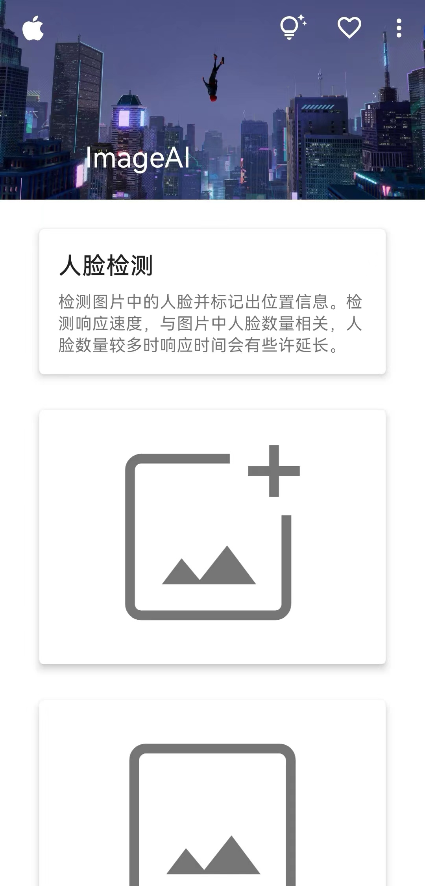

    
  

# ImageAI：一个对图片进行AI处理的APP

**APP下载：** [ImageAI.apk](https://github.com/SolitudeFate/ImageAI/releases/download/v1.0/ImageAI.apk)

## 0. 关于本项目

提供一张图片，可以对图片经过以下处理：人脸检测、黑白图像上色、图像风格转换、图像去雾、图像对比度增强、图像清晰度增强、图像色彩增强、图像去噪

这个APP只是作者的一个作业，在使用上有很多不足需要改进，望海涵！

## 1. 运行配置

+ Android Gradle Plugin Version：7.1.2
+ Gradle Version：7.2
+ Compile Sdk version：33
+ Gradle JDK：17
+ Python：3.8

## 2. 关于前端设计

所有的设计使用的都是[Material Design 2](https://m2.material.io/)

设计初期考虑到可拓展性，所以采用了Google的CoordinatorLayout布局。并且规范了页面的布局和命名，有助于扩展至多个页面。

**页面总体的设计结构：**

+ CoordinatorLayout

+ CollapsingToolbarLayout

+ MaterialToolbar

+ NestedScrollView
  
  + MaterialCardView

+ Button

## 3. 关于Python部分

这里调用了百度AI提供的API实现对图片进行AI处理，个人觉得Java提交请求不如Python来的更方便（并且本人并不是很擅长写Java）。

人脸检测部分的api返回值除了左上角的坐标和宽、高以外，还返回了一个旋转角rotation，经过测验发现，旋转角是以左上角的坐标旋转的。但是不明白为什么rotation要除以60。由于人脸检测框带有旋转角，就不能用cv2.rectangle画矩形了。因此采用了最笨的办法：一条边一条边画。

所有的Python脚本都封装好以后，只需要调用对应脚本的main方法就可以调用功能。但是还有个问题，人脸检测画图需要在图片上画图，但是传入的是Base64，我先将其转换成二进制数据，然后再转换成Numpy数组，用cv2.imdecode来读取图片。

## 4. 关于Java部分

这个部分对于不擅长Java的我来说，真的是很艰难，也算是锻炼自己的能力了。

**工具类utils：**

+ ImagePickerUtils：打开系统相册，选择一张图片展示在页面上，并且将其转成Base64。

> 虽然手机拍照的图片都是JPG格式，考虑到可能会存PNG图片，做了格式判断，避免了这个bug。

+ ImageUtils：将转换后的图片返回的Base64转成bitmap展示在页面上，并且保存成PNG图片到系统相册。

+ PermissionUtils：该应用需要相册的存取权限以及网络权限，检查权限是否开启，如果没开启，会动态申请。

+ ToolbarUtils：将topAppBar的全部功能封装起来，每个页面只需要加载一下即可。跳转到指定的活动页面，将启动标志设置为：`FLAG_ACTIVITY_CLEAR_TASK`和`FLAG_ACTIVITY_NEW_TASK`，即跳转到新页面时，清空栈中原有的实例，并启动一个新任务的活动栈。

**另外：**

解释一下在`ImagePickerUtils.java`中为什么pickImage这个方法中`setImageView(imageView, null);`这里的bitmap值始终设为null，但选择图片后仍会显示在ImageView的原因：

这是因为在pickImage方法中，当选择图片成功后，会通过Glide将图片加载到ImageView中。具体来说，Glide会在后台异步加载图片，然后将其设置到ImageView中。在调用setImageView方法时，传入的是null作为Bitmap参数，这意味着Glide会从指定的Uri中读取图片，然后将其转换为Bitmap，并将其设置到ImageView中。因此，即使传入的Bitmap参数为null，Glide也能成功地加载并显示图片。

**Chaquopy：**

用于实现Java与Python交互。

Chaquopy快速上手：[Chaquopy配置及使用](https://github.com/SolitudeFate/library-reservation-for-android#chaquopy)

**权限检查：**

只需要在启动主页面时，检查权限即可。

Android studio虚拟机的相册没有存取的权限，即无法显示Device File Explorer的`storage\emulated`目录下的内容，不能在`storage\emulated\0\Download`目录下存取图片

**解决方案：关于权限问题，使用Google APIs而非Google Play的模拟器就可以避免权限的配置**

**性能优化：**

将发送请求、显示图片这两个耗时任务放到子线程中，并在获取完结果后，将结果传递回UI线程，最后在UI线程中更新ImageView的显示。

## 5. APK压缩

起初这个APK的大小达到了64MB，经过压缩以后，变成现在的33MB。

这是我第一次尝试压缩，虽然还能压缩的更小，但有些压缩步骤需要慎重操作，我也不太了解，就没再继续了。

APK压缩参考：

+ [Android性能优化之APK 极限压缩](https://cloud.tencent.com/developer/article/1512087)

+ [Android Apk瘦身优化](https://www.jianshu.com/p/ed03e75be736)

## 6. 一些解决Android问题的参考资源

+ [Android Studio模拟器联网](https://blog.csdn.net/AngryPotatoLucky/article/details/106198818)

+ [Android Studio 打包APK](https://blog.csdn.net/qq_38436214/article/details/112288954)
